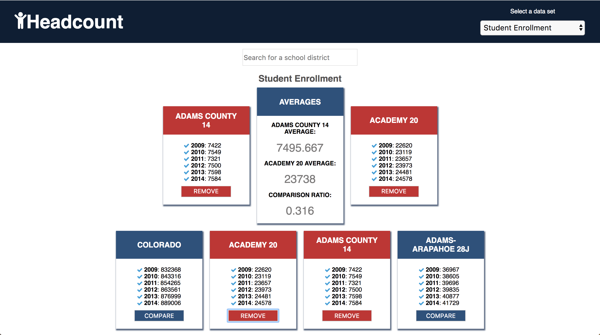

# HeadCount 2.0

###[See this project live at katiescruggs.com/headcount2.0!](http://katiescruggs.com/headcount2.0)

HeadCount 2.0 is a project I completed with my partner [@mariastlouis](github.com/mariastlouis) as part of the [Turing School](http://turing.io) front-end curriculum. We were given a file of static public school data in Colorado. We had to import this data, clean it, and present it in a certain way. We also had to allow the user to compare two school districts on any of the categories and display the comparison data in a certain way. We had one week to complete it.

Technologies used: React, JavaScript, data manipulation.

